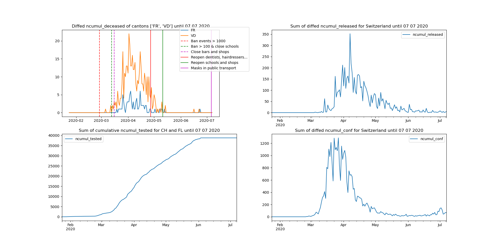

# Covid_19

## Description
This is a set of functions to analyze the data from the csv file from the repository https://github.com/openZH/covid_19.

It fills missing data, checks for inconsistencies in the cumulative numbers and defines useful functions for analysis.

## Setup
### Windows
Run the actualize command to get the new version of the csv file

### Linux
Run the ./actualize.sh command to get the new version of the csv file

## Functions
The function draw_plot can be used to draw a graph of the different columns with several options. Here are graph examples:

## Notes
There are several missing values in the data and some cantons don't update very regularly.

